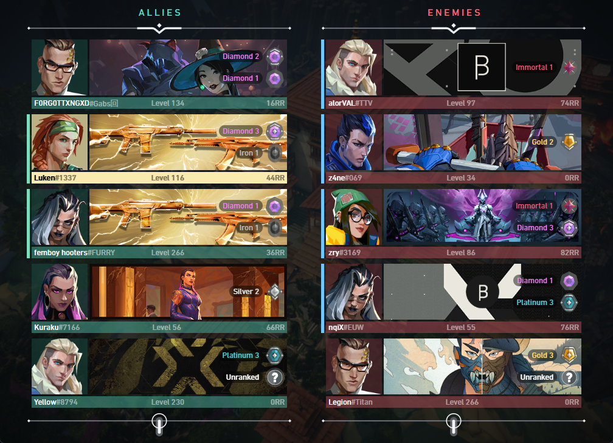
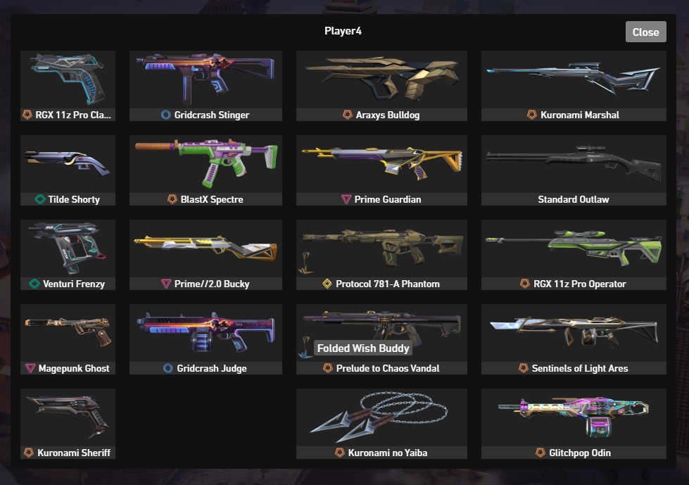

  

<h3 align="center">Valorant Match Spy</h3>

    yet another desktop application to spy on your fellow players

<!---->

## About

this project is powered by [Wails](https://wails.io/docs/gettingstarted/installation)
which runs a [Go](https://go.dev/) application with a [Svelte](https://svelte.dev/) frontend.

## Usage

The following screenshot shows the app visualizing a loading screen style overview of the players:

Hovering over a playercard shows details about a players loadout:

Clicking on the playercard brings up the loadout of the respective player:

## Development & Compiling yourself

* To run in live development mode, run `wails dev` in the project directory.
* To build a redistributable, production mode package, use `wails build`.

## Acknowledgements

* [HeyM1ke](https://github.com/HeyM1ke/ValorantClientAPI) for their initial research on the Client API
* [techchrism](https://github.com/techchrism/valorant-api-docs) for documentation on most endpoints
* [Valorant-API.com](https://valorant-api.com/) which provides a lot of assets used by the game

## Disclaimer

This project is not affiliated, authorized or endorsed by Riot Games, and all associated properties are trademarks or registered trademarks of Riot Games, Inc.
